# SA Reminder — 企业日程与考勤智能提醒平台

企业级日程管理、GPS 考勤打卡、智能提醒与公告通知一体化平台，支持多角色权限管控（系统管理员 / 部门经理 / 普通员工）。

## 技术栈

### 后端

| 技术 | 版本 | 说明 |
|------|------|------|
| Spring Boot | 3.5.11 | 核心框架 |
| MyBatis-Flex | 1.11.5 | ORM 框架 |
| MySQL | 8.0+ | 关系型数据库 |
| HikariCP | 4.0.3 | 数据库连接池 |
| Knife4j (Swagger) | 4.4.0 | API 文档生成 |
| Hutool | 5.8.38 | Java 工具库 |
| Apache POI | 5.4.1 | Excel 导入导出 |
| Spring Boot Mail | — | 邮件发送 |
| Java | 21 | 开发语言 |

### 前端

| 技术 | 版本 | 说明 |
|------|------|------|
| Vue 3 | 3.x | 核心框架 (Composition API) |
| TypeScript | 5.8 | 类型安全 |
| Vite | 7.x | 构建工具 |
| Ant Design Vue | 4.x | UI 组件库 |
| Pinia | 3.x | 状态管理 |
| Vue Router | 4.x | 路由管理 |
| ECharts | 5.x | 数据图表 |
| Axios | 1.x | HTTP 请求 |
| @umijs/openapi | — | API 代码自动生成 |

## 项目结构

```
SA-REMINDER/
├── sa-reminder-backend/                  # Spring Boot 后端
│   ├── src/main/java/.../
│   │   ├── annotation/AuthCheck.java     # 自定义权限校验注解
│   │   ├── aop/AuthInterceptor.java      # AOP 权限拦截器
│   │   ├── common/                       # 统一响应 / 分页 / 通用请求体
│   │   ├── config/                       # CORS / 静态资源 / JSON 配置
│   │   ├── constant/                     # 角色常量
│   │   ├── controller/                   # REST 控制器 (6 个)
│   │   ├── exception/                    # 全局异常处理
│   │   ├── mapper/                       # MyBatis-Flex Mapper (10 个)
│   │   ├── model/
│   │   │   ├── dto/                      # 请求 DTO (15 个)
│   │   │   ├── entity/                   # 数据库实体 (9 个)
│   │   │   ├── enums/                    # 枚举类
│   │   │   └── vo/                       # 视图对象 (14 个)
│   │   ├── scheduler/                    # 定时提醒调度器
│   │   └── service/                      # 业务接口与实现 (7 组)
│   ├── sql/create_table.sql              # 完整建表 DDL
│   ├── avatar/                           # 用户头像存储目录
│   └── sa-reminder-frontend/             # Vue 3 前端
│       └── src/
│           ├── api/                      # 自动生成的 API 控制器 + 类型定义
│           ├── components/               # 全局组件 (Header/Footer/弹窗等)
│           ├── layouts/BasicLayout.vue   # 主布局 (侧边栏+顶栏+内容)
│           ├── pages/                    # 页面组件 (15 个)
│           │   ├── HomeView.vue          # 工作台首页
│           │   ├── user/                 # 登录/注册/个人中心
│           │   ├── admin/                # 管理后台 (用户/部门/公告/考勤)
│           │   ├── schedule/             # 日程管理
│           │   ├── reminder/             # 提醒规则与弹窗
│           │   └── announcement/         # 公告列表
│           ├── router/                   # 路由配置 + 导航守卫
│           ├── stores/                   # Pinia 状态管理
│           └── utils/                    # 工具函数
├── 导入模板.xlsx                         # 批量导入用户 Excel 模板
└── LICENSE                               # MIT License
```

## 功能模块

### 1. 用户与权限管理

- **三种角色**: 系统管理员 (admin)、部门经理 (manager)、普通员工 (user)
- 基于 Session 的身份认证，自定义 `@AuthCheck` 注解实现声明式权限校验
- 用户注册 / 登录 / 退出，头像上传
- 管理员：用户 CRUD、Excel 导出
- 角色数据隔离：管理员看全部，经理看本部门，员工只看自己

> 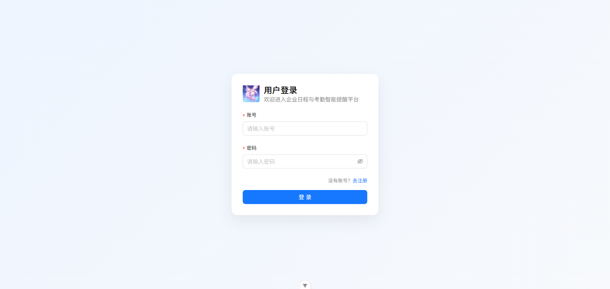
> 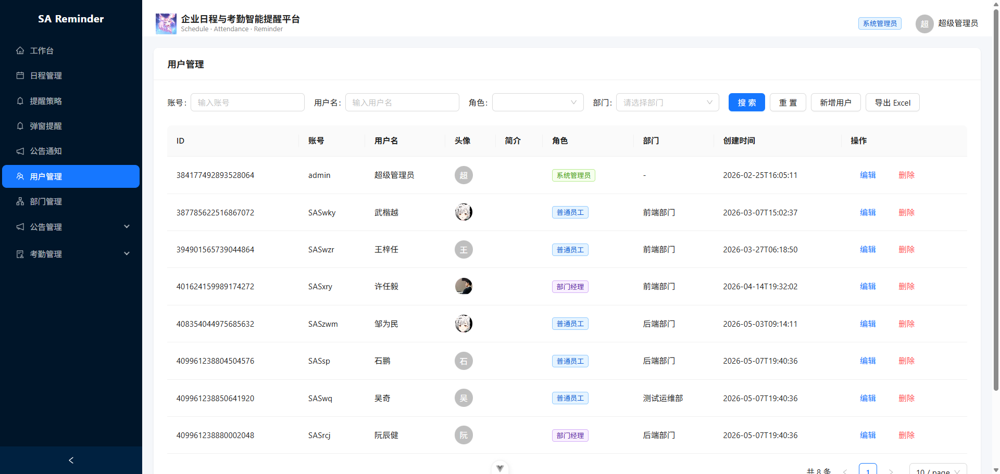
> 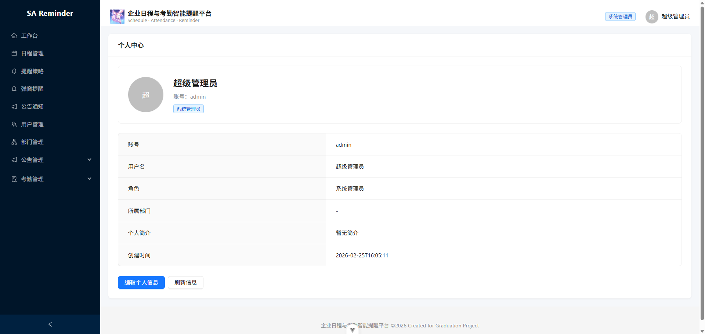

### 2. 部门管理

- 部门 CRUD
- 员工分配 / 跨部门调岗
- Excel 批量导入员工（支持账号、姓名、角色、职位、头像列）

> 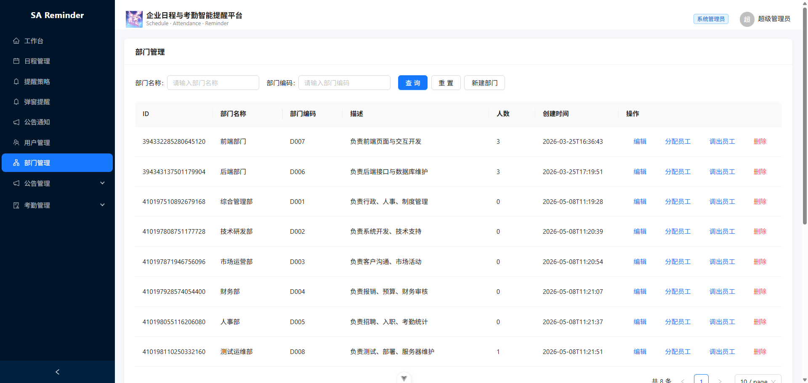
> 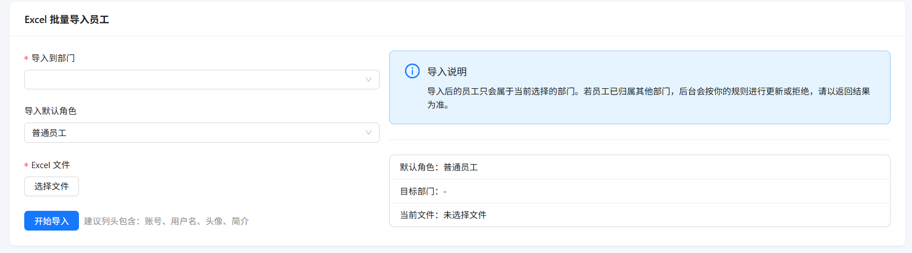

### 3. 日程管理

- 四种日程类型：个人事件、会议、考勤打卡、公司活动
- 按月 / 按日视图展示，颜色标注日程状态（即将开始 / 进行中 / 已过期 / 已取消）
- **时间冲突检测**：创建/修改日程时自动检测参与者时间冲突并提示
- **GPS 考勤配置**：考勤类日程自动开启定位打卡，可配置目标经纬度与有效半径
- 角色创建权限：管理员可创建任意日程，经理仅限本部门，员工仅限个人事件

> 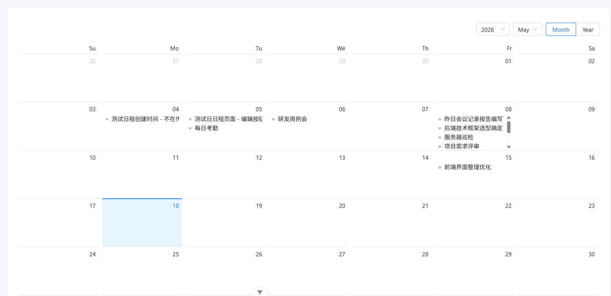
> 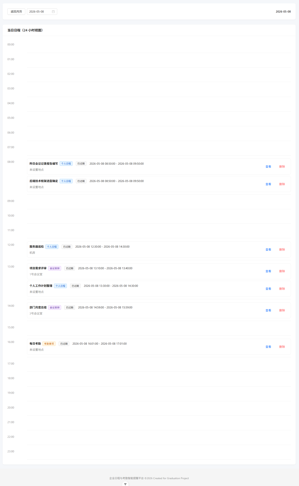
> 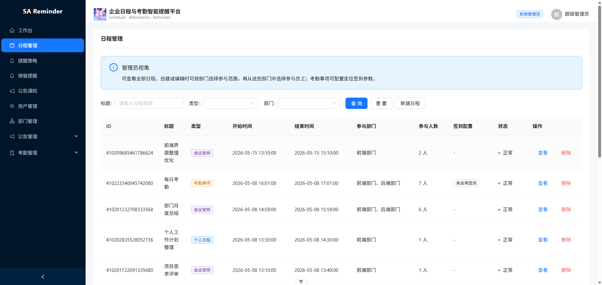
> 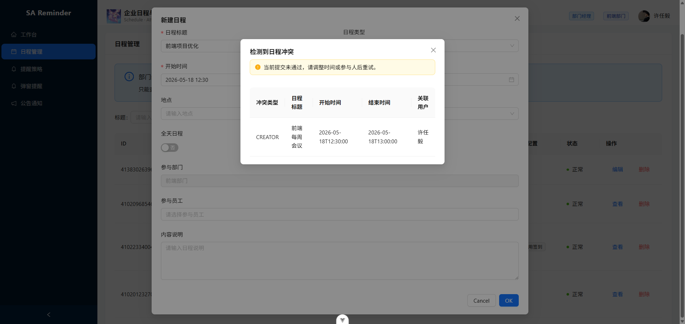

### 4. 智能提醒系统

- 每个日程可配置独立提醒规则：提前时间 (0-30 天)、重复次数、重复间隔
- **定时调度器**（每 60 秒扫描一次）：自动生成提醒任务，经历 pending → sent → read/expired 生命周期
- **全局弹窗提醒**：前端每 15 秒轮询，未读提醒自动弹窗展示
- 重复提醒支持：前一条确认后自动生成下一次提醒任务
- 考勤类提醒需先完成 GPS 打卡才能确认已读

> 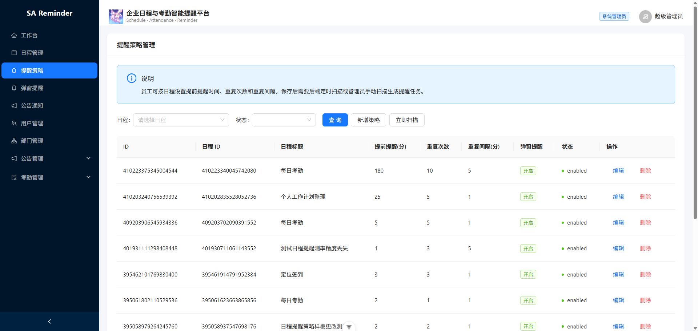
> 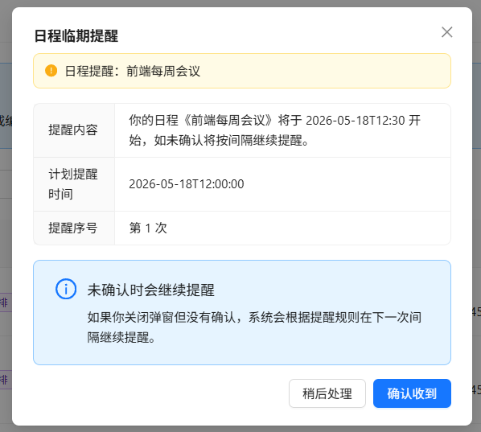

### 5. GPS 考勤打卡

- 基于浏览器 Geolocation API 获取用户当前位置
- **Haversine 公式**计算用户与目标位置距离
- 距离 ≤ 配置半径（默认 200m）方可打卡成功
- 打卡成功后自动关联考勤记录，可导出 / 统计

> 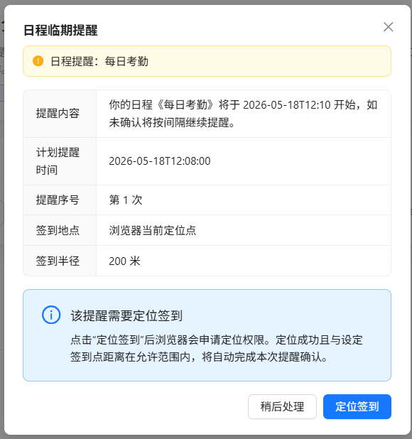

### 6. 考勤统计

- 管理员查看所有考勤记录，支持手动修改考勤状态
- **出勤率统计**：按日程维度统计应到 / 实到人数，ECharts 环形图可视化展示
- 汇总统计：平均出勤率、低出勤率日程数量

> 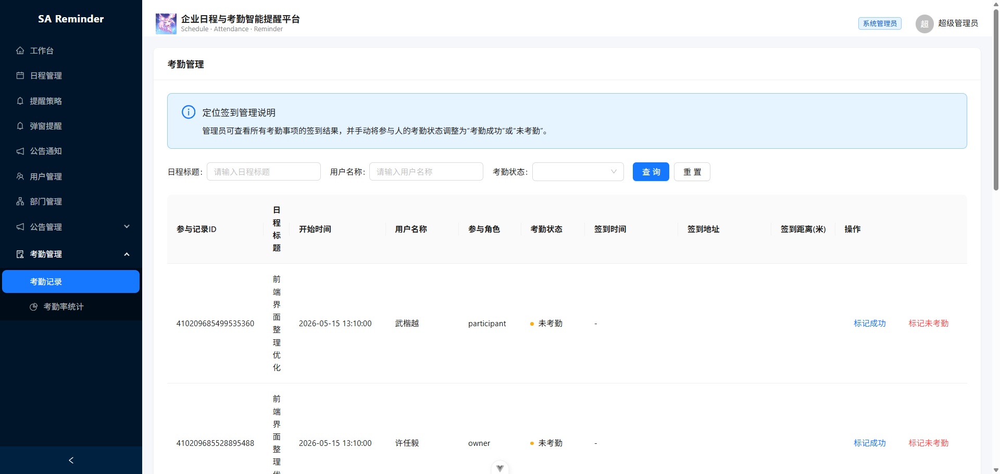
> 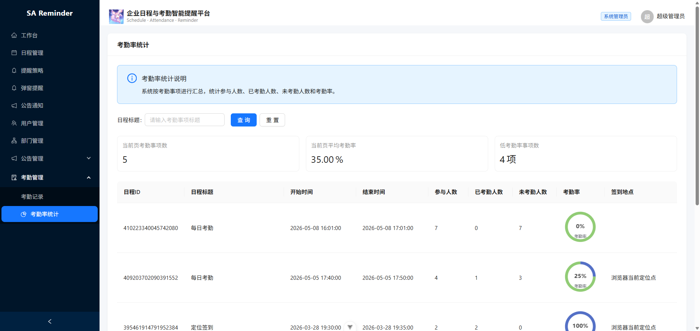

### 7. 公告管理

- 管理员：公告 CRUD，支持全员广播或指定部门推送
- 发布状态管理：草稿 / 已发布 / 已停用
- **已读追踪**：记录每个用户的阅读时间和状态
- **阅读率统计**：按公告维度统计已读 / 未读人数，环形图可视化
- 普通用户：公告列表，一键标记已读

> 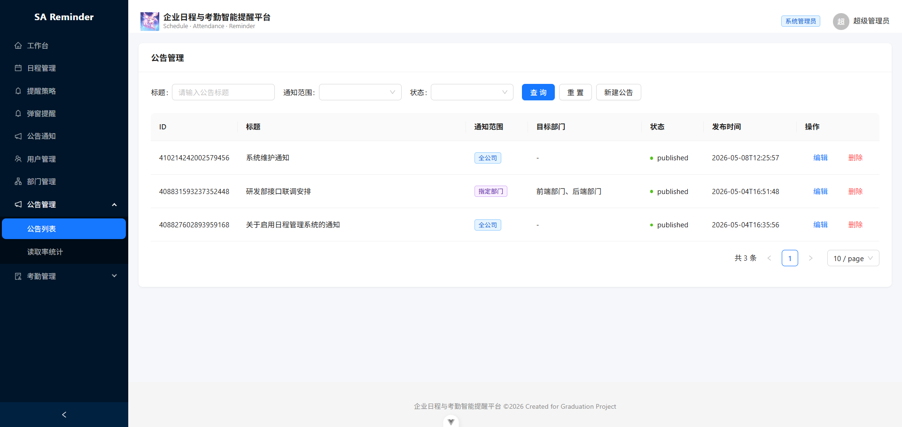
> 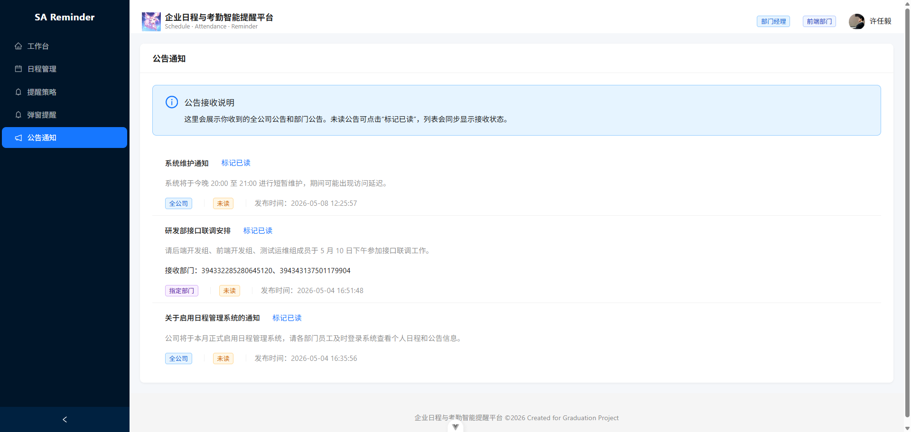
> 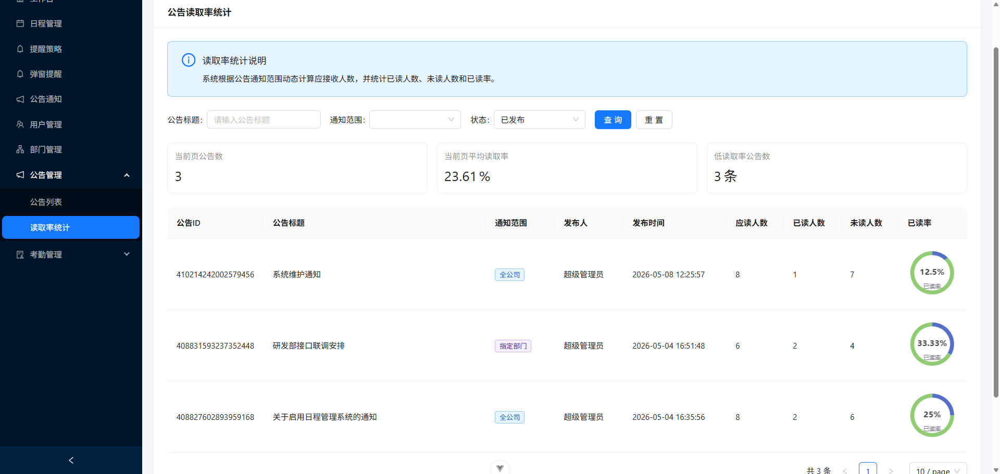

### 8. 邮件通知

- 集成 Spring Boot Mail，支持 SMTP 邮件发送

## 数据库设计

9 张核心表，统一使用雪花 ID (Snowflake) 作为主键，逻辑删除 (`isDelete`) 标记：

| 表名 | 说明 |
|------|------|
| `user` | 系统用户，关联部门 |
| `department` | 组织部门 |
| `schedule_event` | 日程事件，含类型/可见性/GPS 考勤配置 |
| `schedule_participant` | 日程-用户多对多关系，记录出席/打卡状态 |
| `schedule_department` | 日程-部门多对多关系 |
| `schedule_reminder_rule` | 提醒规则配置 |
| `schedule_reminder_task` | 提醒任务实例（生命周期管理） |
| `announcement` | 公告，支持全员/部门推送 |
| `announcement_department` | 公告-部门多对多关系 |
| `announcement_receiver` | 公告已读回执 |

完整建表 SQL 见 `sa-reminder-backend/sql/create_table.sql`。

## 快速开始

### 环境要求

- JDK 21+
- Maven 3.8+
- MySQL 8.0+
- Node.js 18+

### 1. 数据库初始化

```bash
# 创建数据库
mysql -u root -p -e "CREATE DATABASE IF NOT EXISTS sa_reminder DEFAULT CHARSET utf8mb4;"

# 导入表结构
mysql -u root -p sa_reminder < sa-reminder-backend/sql/create_table.sql
```

### 2. 启动后端

```bash
cd sa-reminder-backend

# 修改 application.yml 中的数据库连接信息与邮件配置

# 启动
./mvnw spring-boot:run
```

后端默认运行在 `http://localhost:8080/api`，Knife4j API 文档访问 `http://localhost:8080/api/doc.html`。

### 3. 启动前端

```bash
cd sa-reminder-backend/sa-reminder-frontend

# 安装依赖
npm install

# 启动开发服务器
npm run dev
```

前端默认运行在 `http://localhost:5173`，通过 Vite 代理转发 API 请求到后端。

### 4. 生成前端 API 代码（可选）

后端运行后，执行以下命令自动从 OpenAPI 规范生成 TypeScript API 客户端：

```bash
npm run openapi2ts
```

## 系统页面展示

### 用户端

| 页面 | 截图 |
|------|------|
| 登录 |  |
| 注册 | 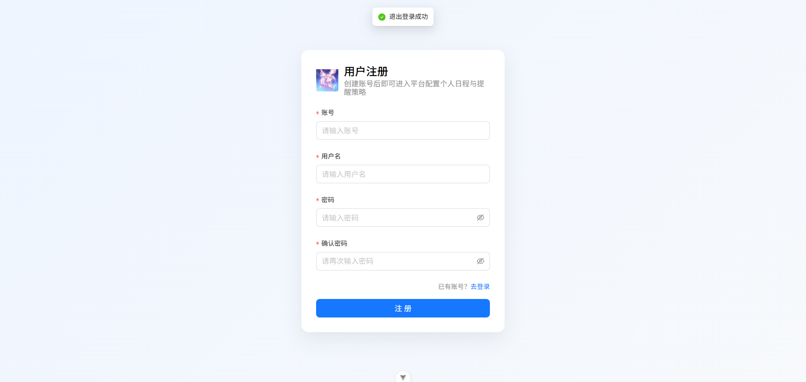 |
| 工作台首页 | 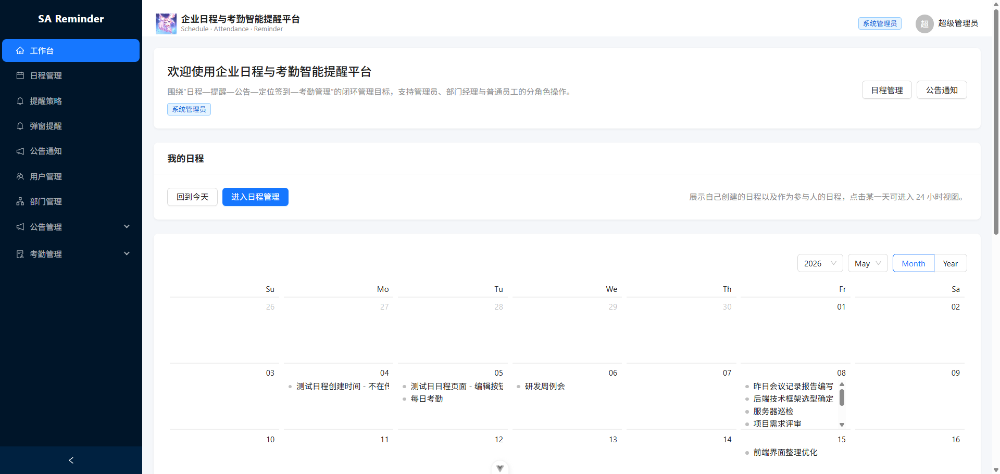 |
| 个人中心 |  |
| 日程月视图 |  |
| 日程日视图 |  |
| 日程管理 |  |
| 提醒规则 |  |
| 提醒弹窗 |  |
| 公告列表 |  |

### 管理端

| 页面 | 截图 |
|------|------|
| 用户管理 |  |
| 部门管理 |  |
| 部门导入 |  |
| 公告管理 |  |
| 阅读率统计 |  |
| 考勤管理 |  |
| 出勤率统计 |  |

## License

MIT License — 详见 [LICENSE](./LICENSE) 文件。
